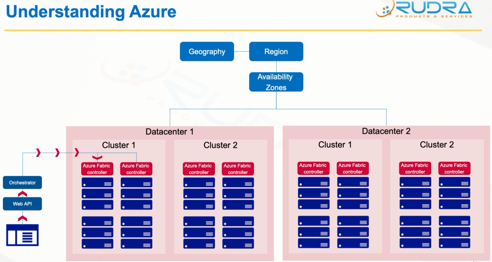
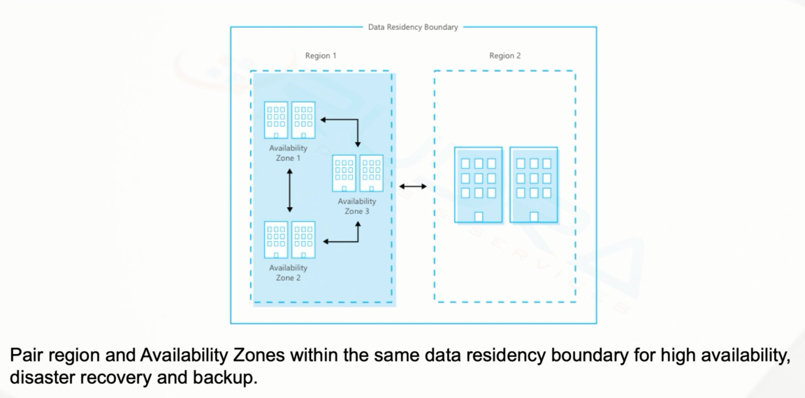

### Geographies
* A geography is a discrete market, typically containing two or more regions, that preserves data residency and compliance boundaries

### Regions
* A region is a set of data centers deployed within a latenct-defined perimeter and connected through a dedicated regional low-latency network
* Check availability of the products by regions

### Availability Zones
* Availability zones a physically separate locations iwthin an Azure region. Each Availability zone is made up of one or more data center equipped with independent power, cooling system and networking

