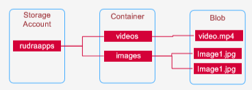

# Azure Storage services –Blob storage
https://docs.microsoft.com/vi-vn/azure/storage/blobs/storage-quickstart-blobs-cli

https://viblo.asia/p/windows-azure-blob-storage-ZDEeLXDoeJb
### Azure blob storage overview

Azure Blob storage is Microsoft's object storage solution for the cloud. Blob storage is optimized for storing massive amounts of unstructured data, such as text or binary data.

* Blob storage is ideal for:
  *  Serving images or documents directly to a browser. 
  *  Storing files for distributed access. 
  *  Streaming video and audio. 
  *  Writing to log files. 
  *  Storing data for backup and restore, disaster recovery, and archiving. 
  *  Storing data for analysis by an on-premises or Azure-hosted service

### Blob storage concepts

* Every blob is placed in a container. Security policies can be assigned to containers which will be cascaded to all objects underthat container.

* A storage account can contain unlimited number of containers and each container can contain unlimited number of blobs up to the limit of storage account size limit ( 2PB for US and Europe and 500TB for all otherregions including UK)

* You can refer to an objectstored inthe blob withthe below format • http://mystorageaccount.blob.core.windows.net/mycontainer/myblob

* The Blob service is based on a flat storage scheme, not a hierarchical scheme. However, you may specify a character or string delimiterwithina blob name to create a virtual hierarchy.

### Blob types
Azure Storage offers three types of blobs—block blobs, append blobs, and page blobs (used for VHD files).
*  Block blobs store text and binary data, up to about 4.7 TB. Block blobs are made up of blocks of data that can be managed individually.

* Append blobs are made up of blocks like block blobs, but are optimized for append operations. Append blobs are ideal for scenarios such as logging data from virtual machines.

* Page blobs store random access files up to 8 TB in size. Page blobs store the VHD files that back VMs.

### Naming and Referencing

##### Container Names
A container name must be a valid DNS name, conforming to the following naming rules:
* Container names must start with a letter or number, and can contain only letters, numbers, and the dash (-)  character. 
*  All letters in a container name must be lowercase. 
*  Container names must be from 3 through 63 characters long.
##### Blob Names
* A blob name can contain any combination of characters. 
* A blob name must be at least one character long and cannot be more than 1,024 characters long, for blobs in Azure Storage. 
* The Azure Storage emulator supports blob names up to 256 characters long. Blob names are case-sensitive. 
* Reserved URL characters must be properly escaped.

### Metadata and Snapshots
**Metadata Names**

Metadata for a container or blob resource is stored as name-value pairs associated with the resource. Metadata names must adhere to the naming rules forC# identifiers.

**Blob Snapshots**

A snapshot is a read-only version of a blob stored as it was at the time the snapshot was created. You can use snapshots to create a backup or checkpoint of a blob. A snapshot blob name includes the base blob URI plus a date-time value that indicates when the snapshot was created.
https://myaccount.blob.core.windows.net/mycontainer/myblob?snapshot=<DateTime>