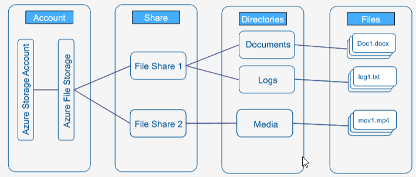

# Azure Storage service - File storage

### Azure file storage

# Azure file storage concepts
* Storage Account: All access to Azure Storage is done through a storage account. See Scalability and PerformanceTargets for details aboutstorage accountcapacity.

* Share: A File Storage share is an SMB file share in Azure. All directories and files must be created in a parent share. An account can contain an unlimited number of shares, and a share can store an unlimited numberoffiles,up to the 5TiB total capacity ofthe file share.

* Directory:An optional hierarchy of directories.  

* File: A file inthe share.Afile may be up to 1TiB insize. 

* URL format: For requests to an Azure file share made with the File REST protocol, files are addressable using the following URLformat:
https://<storage account>.file.core.windows.net/<share>/<directory>/directories>/<file>

### File storage data access methods

* Azure Files offers two, built-in, convenient data access methods that you can use separately, or in combination witheach other,to access your data:

* Direct cloud access: Any Azure file share can be mounted by Windows, macOS, and/or Linux with the industry standard Server Message Block (SMB) protocol or via the File REST API. With SMB, reads and writes to files on the share are made directly on the file share in Azure. To mount by a VM in Azure, the SMB client in the OS must support at least SMB 2.1. To mount onpremises, such as on a user's workstation, the SMB client supported by the workstation must supportatleastSMB 3.0 (with encryption)

* AzureFileSync: With Azure File Sync, shares can be replicated to Windows Servers on-premises or in Azure. Your users would access the file share through the Windows Server, such as through an SMB or NFS share. This is useful for scenarios in which data will be accessed and modified far away from anAzure datacenter,such as ina branch office scenario.

### Data transfer methods
* Azure File Sync: As part of a first sync between an Azure file share (a "Cloud Endpoint") and a Windows directory namespace (a "Server Endpoint"), Azure File Sync will replicate all data from the existing file share toAzure Files.
* Azure Import/Export: The Azure Import/Export service allows you to securely transfer large amounts ofdata intoanAzure file share by shipping hard disk drives to anAzure datacenter.
* Robocopy: Robocopy is a well known copy tool that ships with Windows and Windows Server. Robocopy may be used to transfer data intoAzure Files by mounting the file share locally,and then using the mounted location as the destination inthe Robocopy command.
* AzCopy: AzCopy is a command-line utility designed for copying data to and from Azure Files, as well asAzure Blob storage, using simple commands withoptimal performance.AzCopy isavailable for Windows and Linux.