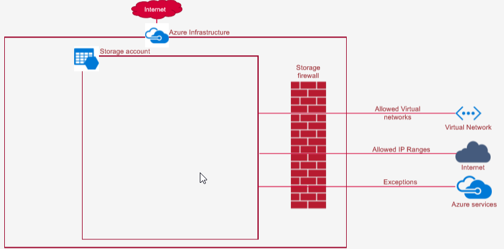
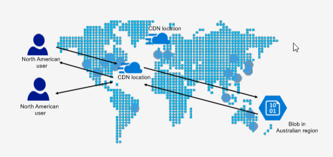

# Storage account & Blob service configuration

### Storage firewall and Virtual networks

### Custom domains
* You can configure a custom domain for accessing blob data in your Azure storage account. The defaultendpointforAzure Blob storage is <storage-account-name>.blob.core.windows.net.
* Limitations
  * Azure Storage does not yet natively support HTTPS with custom domains. You can currently useAzure CDN to access blobs by using custom domains over HTTPS. 
  * Storage accounts currently supportonly one custom domain name per account.

 Resource type | Default URL | Custom domain URL
---------|----------|---------
 storage account | http://mystorageaccount.blob.core.windows.net | http://change.com.vn
 Blob |  http://mystorageaccount.blob.core.windows.net/mycontainer/myblob| http://test.blob.com.vn

### Content delivery network

* The Azure Content delivery Network (CDN) caches static content at strategically placed locations to provide maximum throughput for delivering contentto users.

### Other configuration areas
