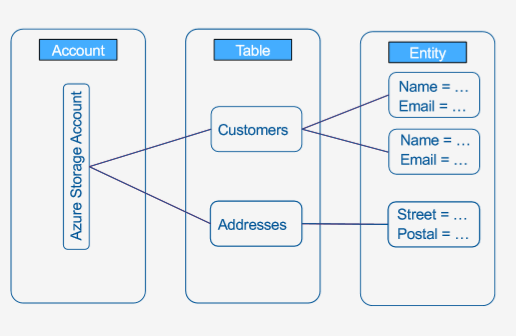

# Azure Storage services –Table & Queue Storage

### Azure Table storage Overview
Azure Table storage stores large amounts of structured data. The service is a NoSQL datastore which accepts authenticated calls from inside and outside the Azure cloud. Azure tables are ideal for storing structured,non-relational data.

Common uses ofTable storage include:

* StoringTBs ofstructured data capable ofserving webscale applications
* Storing datasets that don't require complex joins, foreign keys, or stored procedures and can be denormalized for fastaccess
* Quickly querying data using a clustered index
* Accessing data using the OData protocol and LINQ queries with WCF Data Service .NET Libraries

### Azure Table structure
 

 ### Table Storage concepts
* Accounts:All access to Azure Storage is done through a storage account. All access to Azure Cosmos DB is done through a Table API account. 
* Table: A table is a collection of entities. Tables don't enforce a schema on entities, which means a single table can contain entities that have different sets of properties.
* Entity: An entity is a set of properties, similar to a database row. An entity in Azure Storage can be up to 1MB in size. An entity in Azure Cosmos DB can be up to 2MB in size.
* Properties: A property is a name-value pair. Each entity can include up to 252 properties to store data. Each entity also has three system properties that specify a partition key, a row key, and a timestamp. Entities with the same partition key can be queried more quickly, and inserted/updated in atomic operations. An entity's row key is its unique identifier within a partition.